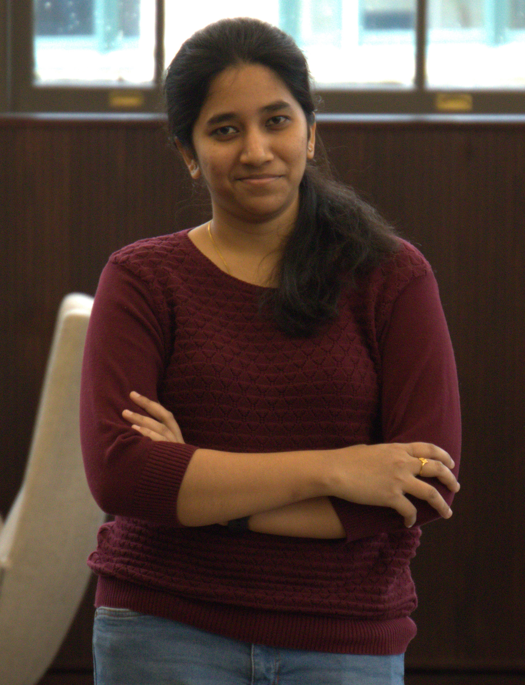

| [Home] (https://radhikag1604.github.io/Telling_Stories_With_Data/) | [About Me](https://radhikag1604.github.io/Telling_Stories_With_Data/blob/main/About%20Me.html) | [More on the Course](https://radhikag1604.github.io/Telling_Stories_With_Data/blob/main/More%20on%20the%20Course.html) | [In Class Exercises]
(https://radhikag1604.github.io/Telling_Stories_With_Data/blob/main/In%20class%20Exercises.html) | [Data_Visualization_1]
(https://radhikag1604.github.io/Telling_Stories_With_Data/Data_Visualization_1.html) | [Critique by Design]
(https://radhikag1604.github.io/Telling_Stories_With_Data/critique-by-design.html) | [Final Project Part I]
(https://radhikag1604.github.io/Telling_Stories_With_Data/final-project-part-one.html) | [Final Project Part II]
(https://radhikag1604.github.io/Telling_Stories_With_Data/final-project-part-two.html) | [Final Project Part III]
(https://radhikag1604.github.io/Telling_Stories_With_Data/final-project-part-three.html) |

# Hi ! I am Radhika Govindarajan 🙂👋

# About me

> Self-Driven, Quick Learner, Passionate Data Analyst with a curious mind trying to solve real-world challenges in healthcare.

Hailing from a small sub-urban town in India, I vividly remember witnessing the delivery of polio  immunization campaigns to address this huge disease. I was always intrigued by how it was able to target a billion people and how the disease was completely eradicated in 2010s. The quest to answer 
these questions led me tocome across two areas of science in my adolescence that piqued my interest - Healthcare and Information Technology. Since then, I have made careful choices in my academic pursuits and career to develop technical expertise in both these areas.                          

My undergraduate journey in biotechnology ignited my passion for applying scientific knowledge to real-world problems. For four years, I took on the role of a technical business analyst within the scientific & clinical informatics team of Zifo RnD Solutions. Here, I led a dedicated team of five or more analysts, spearheading the digital transformation projects for 4 out of the top 10 global biotech, biopharma, life science, and healthcare organizations spanning the USA, UK, and APAC regions. This experience provided me with invaluable insights into the challenges these industries faced and the expertise to adeptly address them, while meeting all client requirements. Currently, I'm on a path of further knowledge acquisition, pursuing a master's degree in healthcare analytics and IT at Carnegie Mellon University. My objective is to leverage this expertise to bridge the existing gaps in health IT and elevate patient outcomes. I am particularly enthusiastic about I am particularly enthusiastic about utilizing advanced data management and analysis techniques on healthcare data to drive innovation and enhance clinical decision-making by harnessing the potential of machine learning algorithms.

My background encompasses biotechnology, healthcare, data analytics and business analysis offering a diverse and multifaceted approach to tackling healthcare challenges. Collaboration is my forte, and I thrive in environments that promote open communication and creative problem-solving.

Scheduled to graduate in May 2024, I am actively seeking opportunities to apply my skills and knowledge, contributing to meaningful change within the healthcare industry. If you're searching for a passionate innovator dedicated to improving patient outcomes and reimagining healthcare, let's connect. Feel free to reach out to me via email at rgovind2@andrew.cmu.edu !
