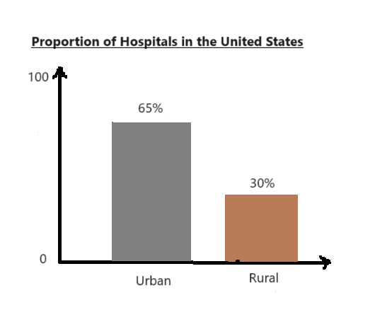

| [Home Page](https://radhikag1604.github.io/Telling_Stories_With_Data/) | [Data_Visualization_1](https://radhikag1604.github.io/Telling_Stories_With_Data/Data_Visualization_1.html) | [Critique by Design](https://radhikag1604.github.io/Telling_Stories_With_Data/critique-by-design.html) | [Final Project Part I](https://radhikag1604.github.io/Telling_Stories_With_Data/final-project-part-one.html) | [Final Project Part II](https://radhikag1604.github.io/Telling_Stories_With_Data/final-project-part-two.html) | [Final Project Part III](https://radhikag1604.github.io/Telling_Stories_With_Data/final-project-part-three.html) |

# Rural Hospitals at Risk of Closure

## Project Overview
I intend to shape my final project narrative around the pressing concern of rural hospitals facing the threat of closure in the United States. The aim is to highlight the gravity of this public policy challenge to my audience, elucidate its far-reaching impact on communities, and ultimately conclude with viable solutions or actions to address the issue.

Healthcare in the United States is a topic of paramount importance. With expenditures surpassing over $1 trillion annually and 39% of this is being directed towards hospitals alone which is way more than any other healthcare sector. Yet, amidst this substantial spending, a deeply concerning trend has emerged - **the closure of rural hospitals**. Despite their smaller scale, rural hospitals  pivotal role in ensuring healthcare accessibility for millions which cannot be overstated. They serve as anchors not for medical care but also for local economies, providing jobs and stability to the communities that rely on them. However, since 2005, over 150 rural hospitals have shuttered their doors and currently around 600 hospitals - 30% of all rural hospitals in the US are at an immmediate risk of closure. With over 20% of the US population residing in rural areas spread across the nation, this poses profound consequences of reduction in access to essential healthcare services to those communities. Moreover, this issue reverberates beyond rural boundaries, impacting urban areas due to the nation's reliance on food supply originating from this area and also their hosting of coal and gas mining stations.The crux of the issue lies in the fundamental dependency of rural hospitals on programs like Medicare and Medicaid, which provide inadequate reimbursement for their services, rendering it unsustainable for them to maintain essential operations and resulting in financial losses. A one-size-fits-all approach, such as a "Global Hospital Budget" or federal proposals, is not a viable solution, as there exists a fundamental disparity in how urban and rural hospitals function. It is imperative to take measures to ensure adequate payments and institute a more equitable payment system that enables rural hospitals to not only survive but thrive in their critical role as healthcare providers for their communities.

## Story Outline
Here's the general **structured outline** of my narrative: 
1. **General Hospital Structure in the United States**
    - Large Urban Hospitals, Small and Rural Hospitals
    - Difference in Operation
2. **Spread of Rural Hospitals in the United States**
    - Distribution of Rural Population in US
    - Distribution of Rural Hospitals State Wide
3. **Importance of Rural Hospitals**
     - Economic Anchor for the community
     - Source of essential healthservice for the rural communities
4. **Emerging Trends in Shutdown in past decade**
     - 150 hospitals closed since 2005
     - 600 hospitals - 30% of total are at immediate risk
5. **Major Causes for Closure**
     - Global Hospital Budget
     - Insufficient reimbursement from programs like Medicare and Medicaid
6. **Call for Action**
     - Targeting funding and financial support
     - Innovative payment system
       
## Initial sketches

- The visual indicates that the proportion of urban hospitals in the US is twice that of rural hospitals. Approximately 39% of the population in the United States resides in rural communities, where healthcare access depends on these hospitals, with half of them facing the imminent risk of closure.

   

- From the trends in closures, it is evident that there has been a consistent increase in hospital closures. Initially, at the onset of the pandemic, there was a temporary decline due to increased funding and an influx of patients. However, these factors were not substantial enough to ensure the continued functioning of the hospitals.

- The primary factor contributing to the financial losses experienced by these rural hospitals is the proportion of payments they receive from private payers in exchange for the services rendered to patients. Hence one-policy-fits it all is not a suitable payment structure for running rural hospitals.

## The Data

To construct a comprehensive narrative, I plan to leverage various publicly accessible datasets. Initially, I will turn to the [World Bank Data](https://www.statista.com/statistics/985183/size-urban-rural-population-us/) to provide a vivid comparison of urban and rural populations in the United States. This foundational understanding will set the stage for exploration.Subsequently, I will utilize data from the [American Hospital Assocation Stats](https://www.aha.org/statistics/fast-facts-us-hospitals) to delineate the proportions of urban and rural hospitals. This insight will serve as a critical backdrop, allowing the audience to grasp the scale and distribution of healthcare facilities in the country. Moving forward, I will draw upon the dataset sourced from the [UNC Sheps Center](https://www.shepscenter.unc.edu/programs-projects/rural-health/rural-hospital-closures/). This datasets will provide a detailed analysis of the annual trends in rural hospital closures. This chronological perspective will shed light on the evolving landscape of rural healthcare accessibility.

Furthermore, I will tap into three datasets made available by the [Center for Healthcare Quality and Payment Reform (CHQPR)](https://ruralhospitals.chqpr.org/Data1.html). These datasets will offer comprehensive insights into the insecure state of rural hospitals. Specifically, I will examine their financial status, assess the presence of different payers, and delve into pricing trends. This approach will enable the audience to grasp the intricate economic dynamics that underpin the viability of rural healthcare institutions.

#### Sources:
1. **World Bank. (May 25, 2022). Size of the urban and rural population of the United States from 1960 to 2020 (in millions)** [Graph].In Statista. Retrieved September 25, 2023, from https://www.statista.com/statistics/985183/size-urban-rural-population-us/
2. **Fast Facts on U.S. Hospitals, 2023 AHA.(.n.d.). American Hospital Association.** 'https://www.aha.org/statistics/fast-facts-us-hospitals'
3. **Rural Hospital closures - Sheps Center. (2023, September 1). Sheps Center.** 'https://www.shepscenter.unc.edu/programs-projects/rural-health/rural-hospital-closures/'
4. **Saving Rural Hospitals - Data on rural hospitals. (n.d.).** 'https://ruralhospitals.chqpr.org/Data1.html'

## Method and medium

As for my plan to compile and deliver the narrative, I am opting to utilize Shorthand as my chosen platform. This is due to its strengths in creating multimedia-rich, engaging stories with an intuitive interface. Shorthand's ability to seamlessly integrate images, videos, and interactive elements ensures a compelling user experience.In conjunction, I will employ Flourish and Tableau for constructing charts and graphs using the data. These powerful data visualization tools offer a wide range of customization options, interactivity, and data integration capabilities. By combining Shorthand for storytelling and Flourish/Tableau for data visualization, I aim to create a comprehensive presentation that effectively conveys both the narrative and the supporting data in an impactful manner.

